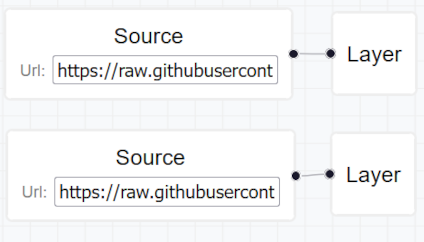
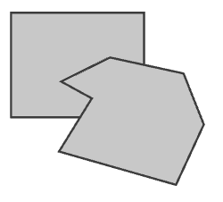
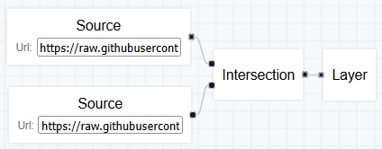
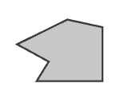
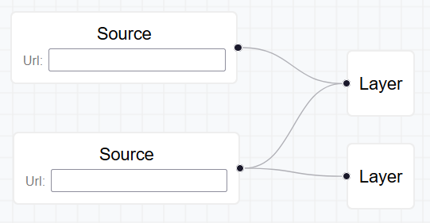
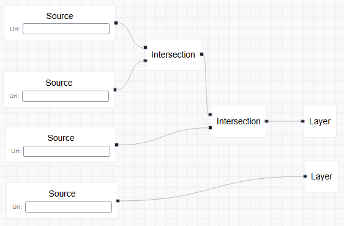

# CARTO Assignment

I've also deployed this code to: [https://carto.dcastro.dev](https://carto.dcastro.dev) 🚀

Implements the carto assignment from the assignment.pdf file, including the Optional functionality of intersecting nodes.

The app initializes with a sample diagram that renders 2 layers.

For your convinience, here's two urls with polygonal GeoJson you can grab to test the intersection:

> https://raw.githubusercontent.com/dcmdestello/carto-assignment/refs/heads/main/public/samplePolygons1.json

> https://raw.githubusercontent.com/dcmdestello/carto-assignment/refs/heads/main/public/samplePolygons2.json

### Example:

|            Diagram            |                    Map                    |
| :---------------------------: | :---------------------------------------: |
|  |  |
|  |  |

### Run:

Install packages first (`npm install`) and execute: `npm run start`

Here's my commentary on the assignment:

## Product decisions

First I considered the multiplicity of the connections of the nodes. Should something like this be possible?

Even before considering the implications for the GeoJSON interpretation of the diagram I decided against these unorthodox cases. The reason is that given that the design of the Interesction Node has 2 source handles, it seems that the UI wants to communicate that this node should receive exactly 2 inputs. We could have had a single source handle that receive N connections, however I agreed it would be a better UI/UX if each handle could only hold a single connection, clearly communicating to the user how to compose different nodes.

This rule of a allowing only a single connection per handle is enforced by the component `SingleConnectionHandle.tsx`.

However, you can compose several intersect nodes and the GeoJSON code does handle it properly, recursively intersecting for any depth.

This is a valid diagram:

The diagram would have a simple Load/Save functionality, for simplicity without any confirmation modal nor the ability to have multiple stored entries to load from. However an extra Clear functionality would be useful and trivial to implement.

## Technical considerations and commentary

This was built on top of a simple vite react-ts template.

I created a DiagramProvider to hold the state of the diagram, as it should be high enough in the component tree so that both the DiagramView and the MapView can consume it. In reality, the state of this diagram should be captured and integrated into whatever overarching state-management framework (e.g. Redux) we would be using.

There is a mock "router" AppRouter just to manually handle toggling between diagram and map that just passes a prop to handle this state. In reality this should be integrated into a routing solution, with its own context and hooks. It would also implement modifying the url on switching views `/diagram` vs `/map`, although this feature would become more useful when diagram ids/sessions were implemented so you could come back to them, so: `/<id>/diagram` and `/<id>/map`

### deck.gl

I was surprised to find that rendering an arbitrary piece of GeoJson with deck.gl was uncomfortable for two unexpected reasons:

- Different instances of GeoJSON would need very different styling configurations to be rendered in nice ways. I applied some styling that seemed reasonable for the examples I was working with, I didn't think the default styling was being good enough.
- Need to manually define a camera state ("ViewState") that is appropiate with the absolute coordinates of the data. There is no auto-fit functionality similar ReactFlow has (that I've found in the short time of looking at this).

The documentation is filled with code that has ad-hoc styling and camera for the hardcoded data in use.

Now, initially I implemented it so the GeoJsonLayer would just receive the url as data so it would automatically handle fetching and parsing, simple and nice. However, I wanted to calculate a bounding box of the data to build a somewhat reasonable ViewState to use as camera, for which I needed the GeoJson data explicitely, not just the urls. Similarly, to implement intersection I'd have to apply the intersect operation to the data itself. Because of these reasons I changed to fetch the data from urls manually and feed it to the GeoJsonLayer, as well as calculate the bounding box and the intersections with it. That way me and the library are not both fetching the same thing twice.

To calculate the GeoJson data I implemented a `resolveNodeGeoJsonData` that is initially called on LayerNodes and recursively uses itself to figure out what GeoJson to feed into it from a node sources. As mentioned it handles arbitrarily composed Intersection Nodes.

I tried to use util functions from turf as much as possible, so that the code is more robust against arbitrary GeoJson shapes that I needed to process to calculate the bounding box and the intersection operation input.

## Folder structure

Took some decisions about folder structure as if it belonged to a bigger project.

- Prefer named exports over default or mixed exports: Reduces uncertainty of how to import components and makes searching for usages a more surefire process.
- A folder containing a component should look like:

  > Component/
  > ├── index.ts # Forwards exports from relevant files in the folder
  > ├── Component.tsx # Main code component code
  > ├── Component.styles.ts # Holds styled-subcomponent used
  > └── [...] # Other files and folders that ideally should only be imported from within this folder.

  This allows to have explicitely named files, scopes the area of responsibility of each file and also enables importing the Component without referring to the inner file. So `import { Component } from './Component` as opposed to `import { Component } from './Component/Component'`. Particularly this makes it so intitially you could have a single, simple file `Component.tsx` somewhere and when that code grew and is in need of supporting files around it then a `Component` folder can be created in its place to hold the files and no import statement need to change.

- I meant to have a `src/components` folder that would hold "brick" or "dumb" components that could be used across the application. These are components that only work with props/state to render some piece of UI that does not know anything about the specific domain or business needs of the product. In the end components from MaterialUI where enough and I didn't need to create any such reusable dumb components. However one of the most important aspects to folder structure and component splitting/composition is to clearly differentiate between the different kinds of components: The ones that care about routing, loading and handling data, the ones that compose pages of your platform, the different widgets and features of your UI with your look and feel and finally the reusable components that should not encode any business-aware logic.

I would not argue that these are the universally correct decisions, or that other alternatives do not have merit, even for this same project. Just wanted to take make some decisions and move on, and these were some of my thoughts.

## Closing thoughts

I thought this was a very nice exercise of demonstrating ability to take on a new framework and achive something interesting quickly. I found the most time-consuming part was learning about the GeoJson specification and figuring out how to handle it: when to use the framework, external utils or to write a solution in-place.

Cheers

- David Castro
